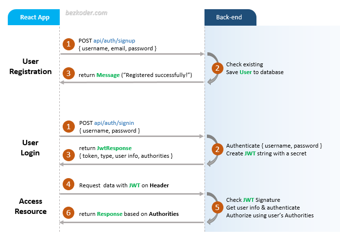

## NgBilling Admin for Mobile Network Operators And MVNO's. React front end communicate with NgBilling to setup Organization and resellers. This is base setup application for default ngbilling database. Admin dashboard application is based on React-Admin.

NgBilling Admin initialize the Organization setup for you: 

- Create the Admin User for the Organization
- Initialize default roles like Customer,Staff
- Initialize default Order status like. Active,Suspended 
- Initialize default Invoice status
- Initialize default dunning policies 
- Initilize default account profiles
- Initilize default Payment Methods.

## Admin Registration and Admin Login Flow
For Token Authentication, we’re going to have 2 endpoints:

- POST `api/auth/signup` for Admin Registration
- POST `api/auth/signin` for Admin Login

The following flow shows you an overview of Requests and Responses that React Client will make or receive. This React Client must add a JWT to HTTP Header before sending request to protected resources.



## React Component Diagram with Router, Axios & LocalStorage


This project was bootstrapped with [Create React App](https://github.com/facebook/create-react-app).

### Set port
.env
```
PORT=8081
```

## Project setup

In the project directory, you can run:

```
npm install
# or
yarn install
```

or

### Compiles and hot-reloads for development

```
npm start
# or
yarn start
```

Open [http://localhost:8081](http://localhost:8081) to view it in the browser.

The page will reload if you make edits.
